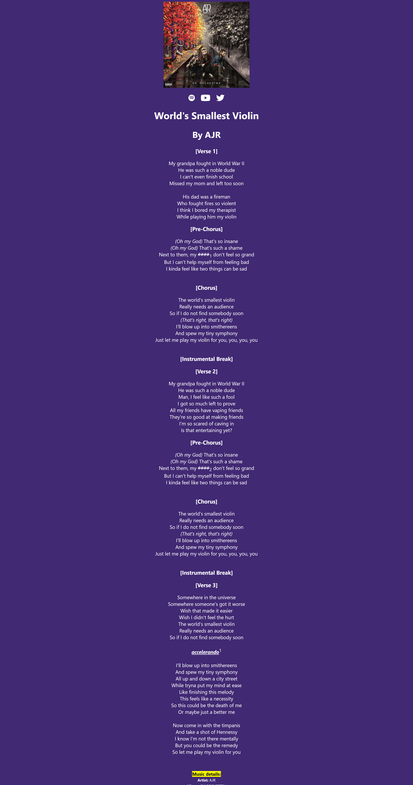

# Lyrics Project
## An HTML project to make a lyrics page

Example used: **World's Smallest Violin** by AJR

```
My grandpa fought in World War II
He was such a noble dude
I can't even finish school
Missed my mom and left too soon

...
```

### Song Details
- **Artist**: AJR
- **Album**: OK ORCHESTRA
- **Released**: March 26, 2021
- **Songwriter(s)**: Adam Met, Jack Met, and Ryan Met

### Technical Details
- **BPM**: 116
- **Key**: F Major
- **Camelot**: 7B
- **Length**: 3:01
- **Explicit**: Yes

## Code Screenshots


---
Encoded by Steven Andrei O. Fontiveros. I do not claim the copyright of given materials (songs, lyrics, videos, cover arts).
